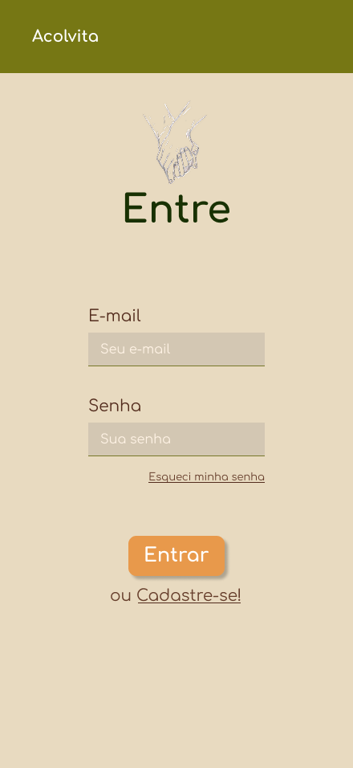
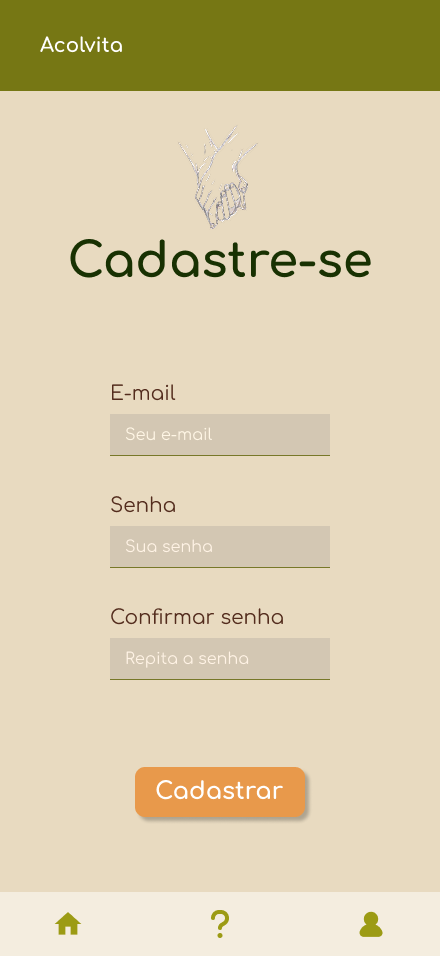
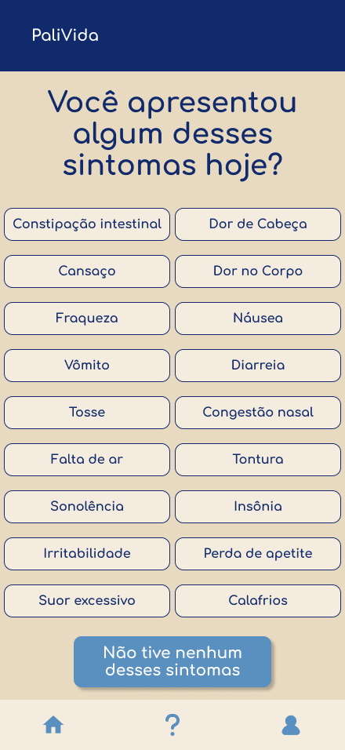
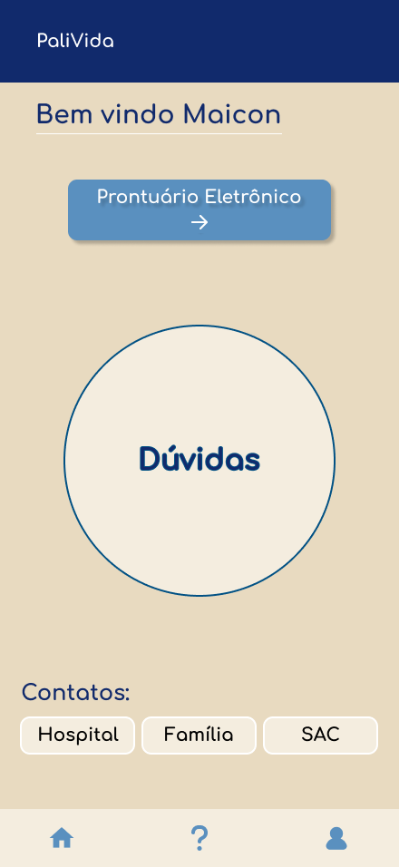
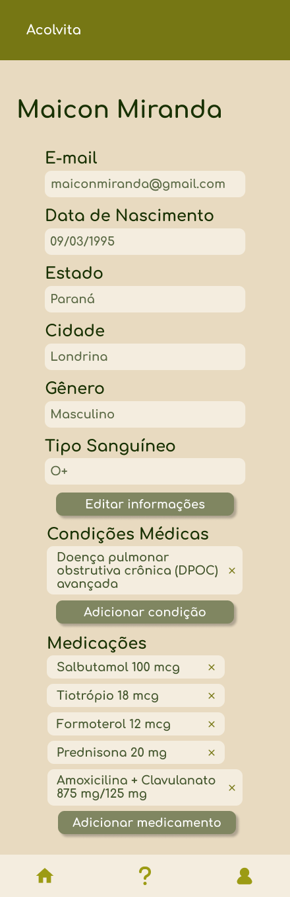
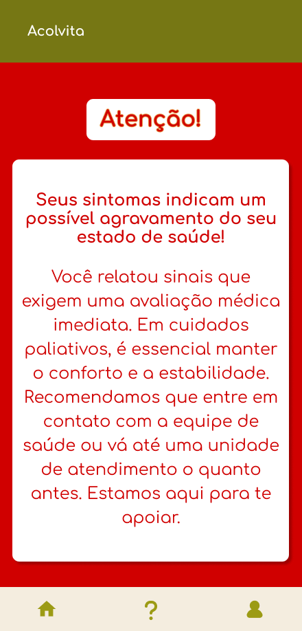
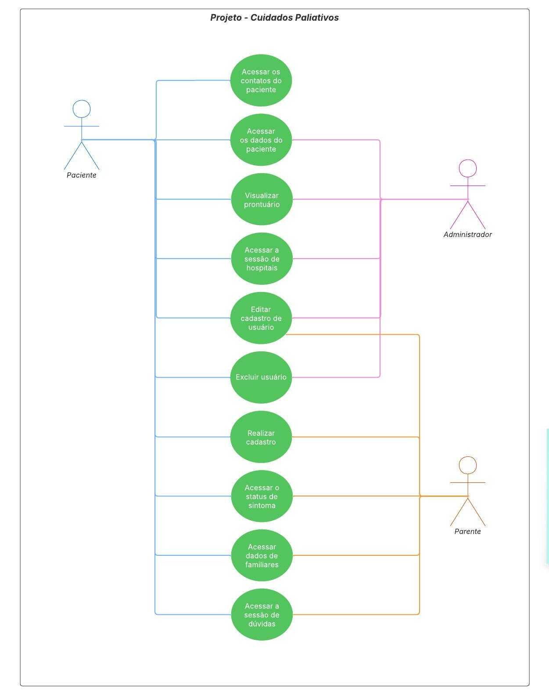

## Projeto Acadêmico sobre Cuidados Paliativos

Este aplicativo foi desenvolvido com finalidade acadêmica e tem como objetivo auxiliar pacientes em cuidados paliativos e seus cuidadores, oferecendo informações, orientações e recursos que possam contribuir para a melhoria da qualidade de vida nesse processo.

### Funcionalides Principais
- Organização de informações de saúde.
- Interface simples e acessível.

### Público-alvo
- Pacientes em cuidados paliativos.
- Familiares e cuidadores.

---

# Acolvita

O projeto consiste em um aplicativo mobile voltado ao monitoramento do bem-estar de pacientes em cuidados paliativos, oferecendo recursos que promovem qualidade de vida, segurança e comunicação entre pacientes, familiares e médicos.

* Público-alvo: pacientes em cuidado paliativos, familiares e médicos. 

## MVP ─ Principais Funcionalidades

1. Monitoramento do bem-estar
* Usuário acessará um checklist/pop-up para informar sintomas (ex.: dor de cabeça, enjoo).  
* O sistema calculará um score e exibirá uma cor indicativa:  
  * 🟢 **Verde:** condição estável.  
  * 🟡 **Amarelo:** atenção necessária.  
  * 🔴 **Vermelho:** situação crítica com recomendação de procurar ajuda médica.  

2. Prontuário do paciente
* Campos definidos: ....  
* **Pendência**: decisão futura sobre exportação dos dados ou integração com sistemas de hospitais/unidades de saúde.  

 

| Funcionalidade         | Status                       | Descrição                                                              |
| ---------------------- | ---------------------------- | ---------------------------------------------------------------------- | 
| Checklist de bem-estar | ✅ Implementado (front-end) | Paciente acessa um checklist para informar sintomas                    |
| Prontuário             | ✅ Implementado (front-end) | Histórico de saúde disponível para paciente, familiar e médico         |
| Cálculo de Score       | 🚧 Em desenvolvimento       | O sistema calculará um score e exibirá uma cor indicativa              |

Para visualizar ou baixar a ATA, clique [aqui](https://drive.google.com/file/d/1JC6Judmnn5hLDE83iDCCX8FW-K4gy_4-/view?usp=sharing).

## Prototipação (Front-end)

Com base na prototipação de autofidelização do cliente, desenvolvemos nossa versão no Figma, que foi aprovada (pelo cliente) e atende aos requisitos de usabilidade e experiência do usuário.

Para melhor visualização, acesse: [www.figma.com/design/TV10wmTPGYcn2YrZ2m6sq5/Cuidados-Paliativos?node-id=0-1&p=f&t=jpLFSH9he5UH76jH-0](https://www.figma.com/design/TV10wmTPGYcn2YrZ2m6sq5/Cuidados-Paliativos?node-id=0-1&p=f&t=jpLFSH9he5UH76jH-0).

## Modelagem UML

* ### Casos de Uso

    
<strong>Paciente</strong>

    <ul>
      <li>Acessar os contatos do paciente</li>
      <li>Acessar os dados do paciente</li>
      <li>Visualizar prontuário</li>
      <li>Acessar a sessão de hospitais</li>
      <li>Editar cadastro de usuário</li>
      <li>Excluir usuário</li>
      <li>Realizar cadastro</li>
      <li>Acessar o status de sintoma</li>
      <li>Acessar dados de familiares</li>
      <li>Acessar a sessão de dúvidas</li>
    </ul>
  

  

    
<strong>Parente</strong>

    <ul>
      <li>Realizar cadastro</li>
      <li>Acessar o status de sintoma</li>
      <li>Acessar dados de familiares</li>
      <li>Acessar a sessão de dúvidas</li>
    </ul>
  

  

    
<strong>Administrador</strong>

    <ul>
      <li>Acessar os dados do paciente</li>
      <li>Visualizar prontuário</li>
      <li>Acessar a sessão de hospitais</li>
      <li>Editar cadastro de usuário</li>
      <li>Excluir usuário</li>
    </ul>
  

