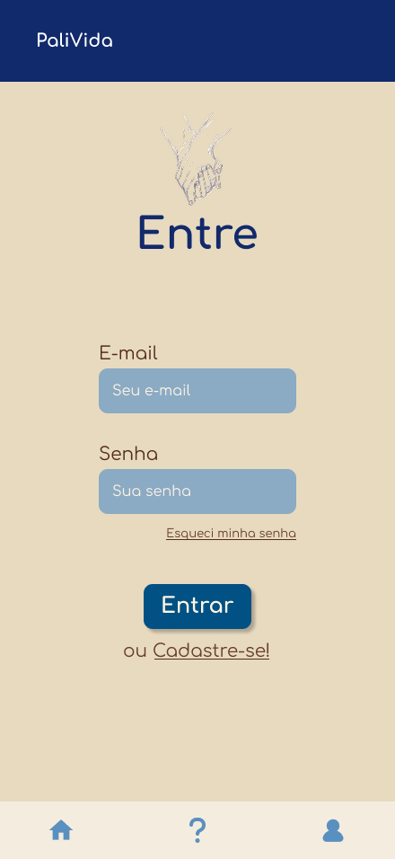

# Acolvita ─  Projeto Acadêmico sobre Cuidados Paliativos

O projeto consiste em um aplicativo mobile desenvolvido com finalidade acadêmica, voltado ao monitoramento do bem-estar de pacientes em cuidados paliativos. A proposta é auxiliar tanto os pacientes quanto seus cuidadores, oferecendo informações, orientações e recursos que promovam qualidade de vida, segurança e melhor comunicação entre pacientes, familiares e médicos.

* **Público-alvo:** pacientes em cuidado paliativos, familiares e médicos. 

---

## MVP ─ Principais Funcionalidades

### Requisitos Funcionias:

#### 1. Monitoramento do bem-estar
* O sistema deve disponibilizar um checklist/pop-up para registro de sintomas (ex.: dor de cabeça, enjoo, etc.) e calcular um score exibido em cores: 
  * 🟢 **Verde:** condição estável.  
  * 🟡 **Amarelo:** atenção necessária.  
  * 🔴 **Vermelho:** situação crítica com recomendação de procurar ajuda médica.  

#### 2. Prontuário do paciente
* O usuário poderá inserir e atualizar informações pessoais e histórico médico (nome, apelido, e-mail, data de nascimento, estado, cidade, gênero, tipo sanguíneo, condições médicas, medicamentos, contato de emergência e contato do hospital/médico responsável).
  
* **Pendência**: decisão futura sobre exportação dos dados ou integração com sistemas de hospitais/unidades de saúde.  

## Próximos Passos ─ Demais Funcionalidades 

### Requisitos Funcionais:

* **Registro de Conta:** O sistema deve permitir que o usuário crie uma conta, garantindo segurança e privacidade dos dados.
  
* **Orientação Baseada em Sintomas:** O sistema deve sugerir quando procurar ajuda profissional, exibindo recomendações claras de acordo com os sintomas registrados.
  
* **Aconselhamento e Recursos:** Disponibilizar materiais educativos sobre cuidados paliativos e apoio emocional para pacientes e familiares. 

### Requisitos Não Funcionais:

* **Usabilidade:** O sistema deve oferecer uma interface amigável, intuitiva e acessível, permitindo o uso por pessoas com pouca familiaridade com tecnologia.

* **Segurança e Privacidade:** Os dados do usuário devem ser protegidos, garantindo confidencialidade e integridade das informações pessoais e médicas.

* **Disponibilidade:** O sistema deve estar disponível de forma contínua, reduzindo ao mínimo as interrupções.

* **Desempenho:** O sistema deve processar o cálculo do score de sintomas de forma rápida (tempo de resposta em até alguns segundos).

* **Confiabilidade:** As informações cadastradas devem ser armazenadas corretamente, sem risco de perda ou alteração indevida.

<br>

| Requisito                          | Status                       | Descrição                                                                                                           |
| ---------------------------------- | ---------------------------- | ------------------------------------------------------------------------------------------------------------------- | 
| Monitoramento do bem-estar (F)     | ✅ Implementado (front-end) | Sistema deve exibir checklist ou pop-up para registrar sintomas                                                     |
| Cálculo do score (F)               | 🚧 Em desenvolvimento       | Sistema calcula um score de saúde e exibe cores indicando a condição                                                |
| Prontuário do paciente (F)         | ✅ Implementado (front-end) | Histórico de saúde disponível para paciente, familiar e médico                                                      |
| Registro de conta (F)              | 🚧 Em desenvolvimento       | Sistema permite criação de conta pelo usuário, garantindo segurança e privacidade dos dados                         |
| Orientação Baseada em Sintomas (F) | 🚧 Em desenvolvimento       | Sistema sugere buscar ajuda profissional, mostrando recomendações claras com base nos sintomas registrados          |
| Aconselhamento e Recursos (F)      | 🚧 Em desenvolvimento       | Sistema disponibiliza materiais educativos sobre cuidados paliativos e apoio emocional para pacientes e familiares  |
| Usabilidade (NF)                   | 🚧 Em desenvolvimento       | Sistema oferece interface amigável, intuitiva e acessível, adequada a usuários com pouca familiaridade tecnológica  |
| Segurança e Privacidade (NF)       | 🚧 Em desenvolvimento       | Sistema protege os dados do usuário, assegurando confidencialidade e integridade das informações pessoais e médicas |
| Disponibilidade (NF)               | 🚧 Em desenvolvimento       | Sistema deve operar continuamente, minimizando interrupções                                                         |
| Desempenho (NF)                    | 🚧 Em desenvolvimento       | Sistema processa o cálculo do score de sintomas rapidamente, com tempo de resposta de poucos segundos               |
| Confiablidade (NF)                 | 🚧 Em desenvolvimento       | Sistema armazena as informações cadastradas de forma segura, sem risco de perda ou alteração indevida               |

---

## Prototipação (Front-end)

Com base na prototipação de autofidelização do cliente, desenvolvemos nossa versão no Figma, que foi aprovada (pelo cliente) e atende aos requisitos de usabilidade e experiência do usuário.

<div style="display: flex; gap: 10px; flex-wrap: wrap;">
  
  
  
  
  
  
  
  
  
  
</div>

---

## Modelagem UML

### Casos de Uso

<br>

<details>
    <summary><strong>Entenda o Paciente</strong></summary>
    <ul>
      <li>Acessar os contatos do paciente</li>
      <li>Acessar os dados do paciente</li>
      <li>Visualizar prontuário</li>
      <li>Acessar a sessão de hospitais</li>
      <li>Editar cadastro de usuário</li>
      <li>Excluir usuário</li>
      <li>Realizar cadastro</li>
      <li>Acessar o status de sintoma</li>
      <li>Acessar dados de familiares</li>
      <li>Acessar a sessão de dúvidas</li>
    </ul>
  </details>

  <details>
    <summary><strong>entenda o Parente</strong></summary>
    <ul>
      <li>Realizar cadastro</li>
      <li>Acessar o status de sintoma</li>
      <li>Acessar dados de familiares</li>
      <li>Acessar a sessão de dúvidas</li>
    </ul>
  </details>

  <details>
    <summary><strong>Entenda o Administrador</strong></summary>
    <ul>
      <li>Acessar os dados do paciente</li>
      <li>Visualizar prontuário</li>
      <li>Acessar a sessão de hospitais</li>
      <li>Editar cadastro de usuário</li>
      <li>Excluir usuário</li>
    </ul>
  </details>

---

## Tecnologias Utlizadas (até o momento)

* **Expo CLI:** ferramenta que facilita criar, desenvolver e testar aplicativos React Native rapidamente, sem precisar configurar nativamente Android ou iOS.
* **React Native e JavaScript:** linguagem e framework usados para construir a interface e a lógica do app mobile de forma declarativa e multiplataforma.
* **Ejs:** permite gerar páginas HTML dinâmicas no back-end, que podem ser consumidas pelo app ou navegador, útil para renderizar conteúdos vindos do servidor.

---

## Arquitetura do Projeto¹

<pre><code>
Projetos-Cuidados-Paliativos/
├─ API/
│  ├─ src/
│  │  ├─ controllers/
│  │  │  └─ index.js
│  │  ├─ models/DAO/
│  │  │  └─ DAO/
│  │  │     ├─ AdministradorDAO.js
│  │  │     ├─ ConteudoDAO.js
│  │  │     ├─ PacienteDAO.js
│  │  │     └─ db.js
│  │  └─ views/
│  │     ├─ formPaciente.ejs
│  │     ├─ formadministrador.ejs
│  │     ├─ index.ejs
│  │     ├─ listaConteudo.ejs
│  │     ├─ listaPaciente.ejs
│  │     ├─ listaadministradores.ejs  #
│  │     └─ novoConteudo.ejs
│  ├─ package-lock.json
│  └─ package.json
├─ cuidados_paliativos/
│  ├─ src/
│  │  ├─ assets/
│  │  │  └─ TextoPadrao.js            # exporta fonte padrão
│  │  ├─ components/
│  │  │  ├─ Footer/
│  │  │  │  └─ index.js               # componente responsável pela exportação do footer
│  │  │  ├─ Header/
│  │  │  │  └─ index.js               # componente responsável pela exportação do header
│  │  │  └─ ListaSintomas/
│  │  │     └─ index.js               # componente responsável pela exportação do Flatlist que contém os sinais e sintomas
│  │  ├─ data/                        # contém listas utilizadas em Flatlists
│  │  │  └─ [...]
│  │  ├─ img/
│  │  │  └─ [...]                     # contém imagens utilizados na aplicação
│  │  └─ pages/
│  │     ├─ Duvidas.js                # página de dúvidas, onde o usuário terá acesso às demais páginas
│  │     ├─ MenuSintomas.js           # página do checklist/pop-up (menu) dos sinais e sintomas
│  │     └─ PerfilProntuario.js       # página do prontuário eletrônico do paciente
│  ├─ App.js                          # página principal (menu dos sinais e sintomas)
│  ├─ app.json
│  ├─ index.js                        # arquivo de entrada da aplicação, que registra e inicia o App.js (ou outro) no dispositivo
│  ├─ metro.config.js
│  ├─ package-lock.json               # registra versões exatas das dependências, garantindo consistência e evitando problemas de compatibilidade
│  └─ package.json                    # configuração da aplicação, listando dependências, scripts e metadados da aplicação (pacotes Node e React Native)
└─ package-lock.json                  # configuração do projeto, listando dependências, scripts e metadados do prjeto (pacotes Expo SDK)
</code></pre><br>

1 - Alguns arquivos e pastas foram omitidos por não serem essenciais para o entendimento do projeto.

---

## Como rodar em diferfentes ambientes:

### 1. Pré-requisitos

Antes de rodar a aplicação, você precisa ter alguns softwares instalados no seu computador:

#### 1.1 Git

O Git é necessário para clonar o repositório da aplicação.

* **Download:** [https://git-scm.com/downloads](https://git-scm.com/downloads).
* **Verificar instalação:** abra o terminal ou CMD/PowerShell e rode:

```bash
git --version
```

Se aparecer a versão do Git, está correto.

#### 1.2 Node.js

O Node.js é necessário para instalar pacotes e executar scripts do React Native.

* **Versão recomendada:** >= 18.0.0
* **Download:** [https://nodejs.org/](https://nodejs.org/).
* **Verificar instalação:**

```bash
node -v
npm -v
```

#### 1.3 Navegador moderno

Para usar o Expo Web e abrir a interface de controle da aplicação, é necessário um navegador moderno (Chrome, Edge, Firefox ou Safari atualizado).

#### 1.4 Expo CLI

O Expo facilita rodar a aplicação em web, Android e iOS sem complicações extras.

**Instalação via npm:**

```bash
npm install --global expo-cli

```

**Verificação:**

```bash
expo --version
```

Se aparecer a versão, está pronto.

**Observação**: Não é necessário instalá-lo, pois o mesmo já encontra-se presente no projeto.

### 2. Clonar o repositório

Com o Git instalado, clone o repositório da aplicação:

```bash
git clone https://github.com/luizaisok/Projeto-Cuidados-Paliativos.git
```

Entre na pasta do projeto:

```bash
cd cuidados_paliativos
```

# 3. Instalar dependências

Dentro da pasta do projeto, rode:

```bash
npm install
```

Isso instala todas as bibliotecas necessárias para rodar a aplicação (inclusive o `expo-cli`).

### 4. Rodar a aplicação

#### 4.1 Rodando no navegador (Web)

Se você quer apenas abrir a aplicação no navegador:

```bash
npx expo start --web
```

Isso abre a interface do Expo no navegador, com a aplicação rodando no modo web.

#### 4.2 Rodando no celular ou emulador

Se quiser testar no celular físico:

1. Abra o aplicativo Expo Go (Android ou iOS)
2. Escaneie o QR Code que aparece na interface do Expo (`npx expo start`)
3. A aplicação será carregada diretamente no seu dispositivo

Para emuladores (Android Studio ou Xcode), abra o emulador primeiro e depois rode:

```bash
npx expo start
```

E escolha a opção de abrir no emulador.

---

<h2>Contribuições</h2>
<p align="justify">Este projeto está aberto para contribuições via <i>issues</i>. Se você encontrou um <i>bug</i>, deseja sugerir uma melhoria ou tem dúvidas sobre o funcionamento, siga as instruções abaixo:</p>
<ol>
    <li>Verifique se já existe uma <i>issue</i> sobre o assunto. Caso sim, adicione um comentário nela.</li>
    <li>Se não houver, abra uma nova <i>issue</i> com uma descrição clara e objetiva.</li>
</ol>

---

## Licença e Autoria

Esse projeto está sendo dessenvolvido por [Luiza Mariana de Carvalho Martins](https://www.linkedin.com/in/luiza-mariana-dev/), [Matheus Ventura Nellessen](https://www.linkedin.com/in/dev-matheusvn/) e [Ana Carolina Aguiar Pereira](https://www.linkedin.com/in/ana-carolina-aguiar-pereira/); e está licenciado sob a licença `CC BY-NC-ND 4.0`. Visualize o [documento](./LICENSE) para mais informações.

<details>
<summary>Entenda a licença 👇</summary>

<br>

É permitido compartilhar o material, ou seja, copiar e redistribuir em qualquer suporte ou formato.  

As condições para esse uso são:  

- **Atribuição** — deve ser dado o devido crédito, incluindo um link para a licença e a indicação de possíveis alterações, de forma razoável e sem sugerir que os autores endossam o uso.  
- **Não Comercial** — o material não pode ser utilizado para fins comerciais.  
- **Sem Derivações** — não é permitido remixar, transformar ou criar a partir do material para redistribuição.  
- **Sem restrições adicionais** — não podem ser aplicados termos jurídicos ou medidas tecnológicas que impeçam ou restrinjam legalmente o que a licença já permite.  

</details>
